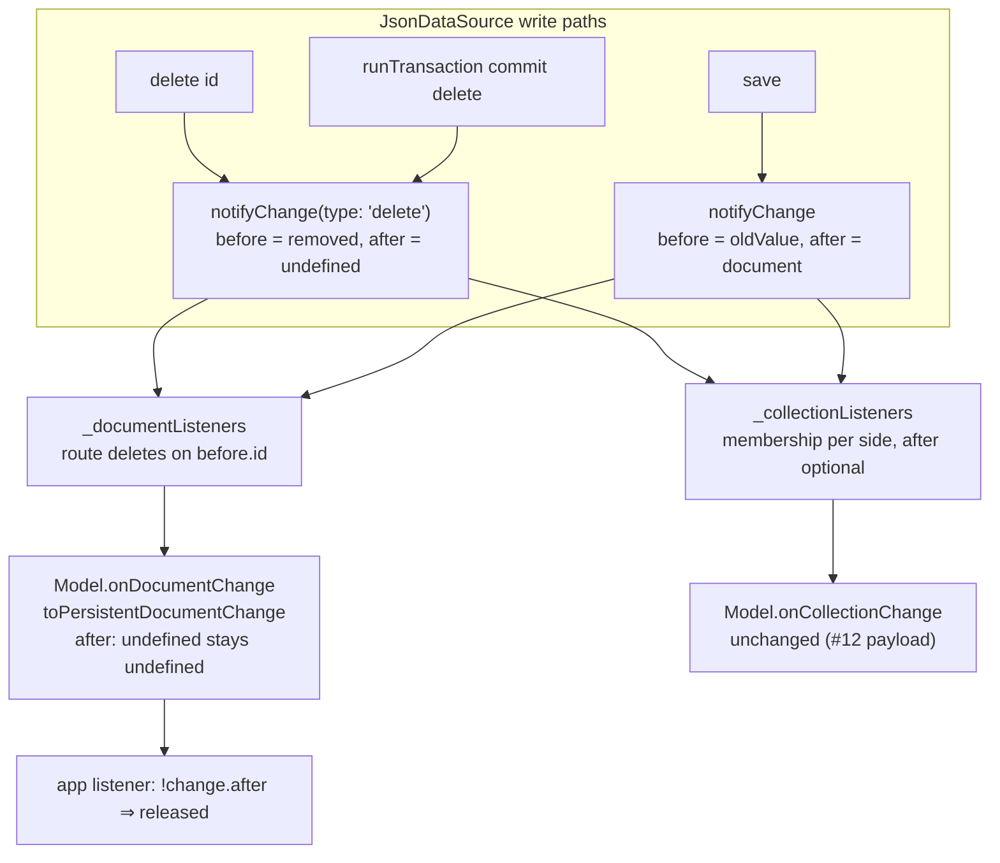

# Design — Align onDocumentChange deletion payload (gh-issue-13)

## Problem recap

`DataSource.onDocumentChange` reports deletions inconsistently across the two
shipped data sources:

- `FirebaseDatasource`: `{ type: 'delete', before: undefined, after: undefined }`
  (Firestore's `snapshot.data()` is `undefined` once the doc is gone).
- `JsonDataSource`: `{ type: 'delete', before: <removed>, after: <removed> }` —
  `notifyChange()` reuses the removed document as both `before` and `after`.

A consumer detecting deletion with `if ( !change.after )` therefore works against
Firebase but silently re-adopts the stale document under `JsonDataSource` (the
production/mock divergence reported in the issue).

## Contract (from the issue's Proposed contract, scoped to `onDocumentChange`)

1. `type === 'delete'` ⇒ `after: undefined`.
2. `before` MAY carry the last known document (JsonDataSource does).
3. `type === 'delete'` ⟺ `!change.after` — both detection idioms are equivalent.

**Scope boundary.** The equivalence applies to the `onDocumentChange` stream only.
`onCollectionChange` keeps the #12 convention (`after` = last known matching
document + `type: 'delete'`, plus the `snapshot` argument), which the issue
explicitly contrasts with this contract and which `collection-change-removal.spec.ts`
pins. The collection listener *transforms* the raw event into its own stream
payload, so both conventions coexist without conflict.

## Strategy

One fix point, two routing adaptations:

- `notifyChange()` is the single emitter for both delete paths (`delete()` and the
  `runTransaction` commit). Special-case `type === 'delete'` there so `after` is
  `undefined` and `before` keeps the removed document — both call sites are fixed
  at once and no future delete path can diverge.
- `onDocumentChange`'s guard currently routes on `change.after.id === documentId`,
  which would swallow deletions once `after` is unset. Route deletes on
  `change.before.id` (the removed document's id) instead.
- `onCollectionChange`'s guard `if ( !change.after ) return` would drop deletion
  events (regressing #12 REQ-2/REQ-3). Evaluate membership per side with `after`
  optional; the emitted collection payload logic (`after: afterMatches ? after :
  before`) is unchanged, so #12 behaviour is preserved verbatim.

## Component interaction

## Audit notes

Independent audit against `document-change-delete-payload.feature` and the modified
`src/store/json-data-source.ts` (design rationale disregarded):

- **Overview**: The contract invariant (`type === 'delete'` ⇒ `after: undefined`) is
  enforced at the single emitter (`notifyChange`), so every delete path — direct and
  transactional — is covered by construction; the two routing guards were adapted to
  the payload they now receive. No public types changed, no new modules, no dead code
  introduced. All seven `[REQ-n]` scenarios trace to code paths that satisfy them.
- **Files**: `src/store/json-data-source.ts` (`notifyChange` [REQ-2, REQ-3, REQ-5, REQ-6],
  `onDocumentChange` [REQ-1, REQ-4], `onCollectionChange` [regression pin for #12]);
  specs updated: `collection-change-removal.spec.ts` REQ-4, `specs/gh-issue-12/*.feature`
  REQ-4 wording.
- **Less valuable improvements found (not applied)**:
  - *Worth exploring*: `delete()` and the transaction commit still pass the removed
    document as `notifyChange`'s `document` argument, which the emitter discards for
    `type: 'delete'`. Passing `undefined` would be honest but loosens the parameter
    type for a cosmetic gain; the central conditional is the stronger invariant.
  - *Speculative*: "deletes route on `before.id`" is stated in both listener guards;
    a shared `changedDocumentId( change )` helper would centralize it, but with two
    call sites in one file that would be indirection without leverage.
- **Strength**: no major architectural friction detected; audit stopped at Step 2.
  Full suite (279 tests) and build re-verified GREEN after the audit.

## Plan

1. Write failing tests `src/store/document-change-delete-payload.spec.ts`
   (REQ-1..REQ-7) per `specs/gh-issue-13/document-change-delete-payload.feature`.
2. `notifyChange`: build the event with
   `after: type === 'delete' ? undefined : document`.
3. `onDocumentChange`: route on `change.type === 'delete' ? change.before?.id :
   change.after?.id`.
4. `onCollectionChange`: make `afterMatches` conditional on `change.after` and
   drop the blanket `if ( !change.after ) return`; membership gate
   `!beforeMatches && !afterMatches` unchanged.
5. Update `collection-change-removal.spec.ts` REQ-4 (its assertion pinned the old
   `after`-carries-removed-doc document payload) and clarify the REQ-4 scenario
   wording in `specs/gh-issue-12/collection-removal-semantics.feature` so the
   `before`-carries-doc contract is unambiguous.
6. Run `npm test`, refactor, `npm run build`.

## Proposed changes

| File | Change |
| --- | --- |
| `src/store/json-data-source.ts` | `notifyChange` omits `after` on `delete`; `onDocumentChange` routes deletes via `before.id`; `onCollectionChange` tolerates a missing `after`. |
| `src/store/document-change-delete-payload.spec.ts` | New — one test per REQ-1..REQ-7. |
| `src/store/collection-change-removal.spec.ts` | REQ-4 assertion updated to the new contract (`after` undefined, `before` carries `d1`). |
| `specs/gh-issue-13/*` | Feature + this design doc. |
| `specs/gh-issue-12/collection-removal-semantics.feature` | REQ-4 scenario wording pinned to `before`. |

No public API/type changes: `DocumentChange.after` is already optional.
`cached-props-updater` already early-returns on `event.type !== 'update'`;
`DataSource.toPersistentDocumentChange` already maps a falsy `after` to
`undefined` — neither needs modification.

## Best practices used

- **Single fix point**: one emitter special-case covers every delete path.
- **Minimum diff**: only guards that route on `after` are adapted; no type
  changes, no new modules.
- **Traceability**: `[REQ-n]` in feature ↔ design ↔ test names.
- **Regression pinning**: #12's collection contract is asserted unchanged.

## Strengths

- Makes the two deletion idioms equivalent, so the downstream `!after` release
  pattern behaves identically under mocks and production data sources.
- Additive for consumers that already branch on `type === 'delete'`; only
  consumers that *relied* on `after` carrying the removed doc change — exactly
  what the contract mandates.
- Firestore's own `exists()/data()` semantics already define this payload; the
  mock now mirrors the platform.

## Weaknesses

- The `onCollectionChange` stream still reports `type: 'delete'` with a truthy
  `after` (the #12 convention), so the equivalence is stream-specific and must be
  documented per stream.
- A consumer using `change.after` to detect *which* doc was deleted must now read
  `change.before` — a breaking change for that idiom (intended by the contract).
- A shared cross-plugin conformance suite would pin this permanently; out of
  scope for this repo (see report follow-ups).
