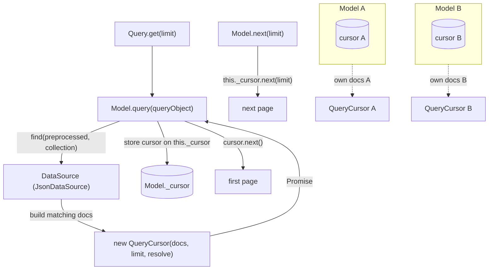
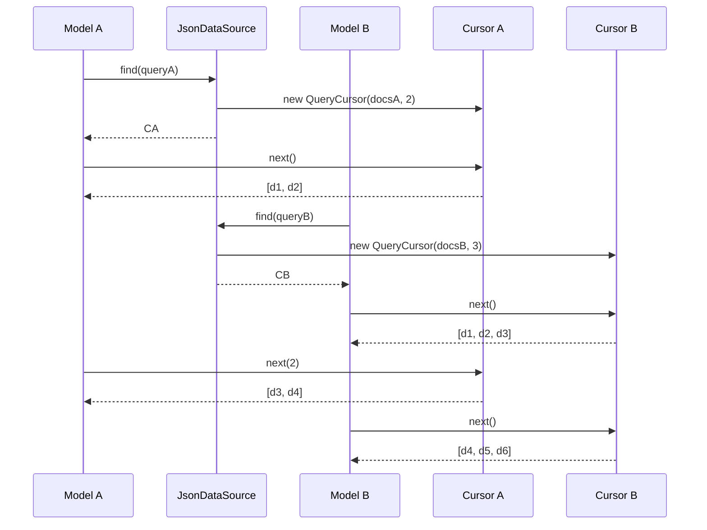

# Design — Per-query pagination cursors (gh-issue-15)

## Problem recap

`JsonDataSource` keeps `_lastMatchingDocs`, `_lastLimit` and `_cursor` as single
instance fields. `Store` holds one `DataSource`, and every `Model` delegates
`next()` to `this._stream.next()`. Pagination is therefore global to the adapter:
a second query overwrites the first query's result set, limit and position, so
interleaved `find()`/`next()` calls return the wrong pages.

## Strategy

Three decisions.

### 1. Where the per-query state lives

| Option | Assessment |
| --- | --- |
| Keep it on the data source but key it by model/collection | Still shared mutable state on the adapter; interleaving the same collection from two models would clobber. |
| Put it on `Model` | Local to each `Model` instance, but the data source owns filtering/sorting, so the model would need the full match set. |
| **Introduce a `QueryCursor` produced by `find()` and held by the caller** | The data source produces the handle once (it owns the match set); the caller (`Model`) holds it. No shared state. Matches the issue's proposed direction. |

**Chosen: `QueryCursor`.** A small, deep module: it hides result set, limit and
position behind one method, `next( limit? )`. `DataSource.find()` returns a
`QueryCursor` instead of `DocumentObject[]`; `DataSource.next()` is removed
because a cursor is the only meaningful way to ask for the next page.

### 2. Where the first page is produced

`find()` builds the full matching set (existing `queryProcessor` chain, including
`operations` and `sort`) and returns a cursor positioned before the first page.
`Model.query()` stores that cursor and calls `next()` to obtain the first page.
`Model.next()` advances its own cursor. This keeps the existing observable
contract: `find().get( limit )` returns the first `limit` documents and
`model.next()` returns the following page.

### 3. Keeping the simulated-delay contract

`JsonDataSource.resolveWithDelay` and `wait()` already give tests deterministic
async behaviour. The cursor is constructed with an injected resolver bound to
`resolveWithDelay`, so both `find()` and every `cursor.next()` participate in
`wait()` exactly as before.

## Component interaction

## Proposed changes

- **`src/store/query-cursor.ts`** (new)
  - `QueryCursor` holds `docs`, `limit`, `position`; `next( limit?: number )`
    slices the next page, advances `position`, and resolves through an injected
    `QueryCursorResolver` (defaults to an immediate resolve).

- **`src/store/data-source.ts`**
  - `find( queryObject, collectionName )` now returns `Promise< QueryCursor >`.
  - Remove the `next( limit? )` abstract method; a cursor is the only seam for
    pagination. **Breaking change** for custom `DataSource` adapters.

- **`src/store/json-data-source.ts`**
  - `find()` computes the matching docs and returns
    `new QueryCursor( matchingDocs, queryObject.limit || 0, resolveWithDelay )`.
  - Remove `next()`, `_lastMatchingDocs`, `_lastLimit`, `_cursor`, `incCursor`
    and the unused `decCursor`.

- **`src/store/model.ts`**
  - `query()` awaits the cursor, stores it in `Model._cursor`, and returns the
    first page via `cursor.next()`.
  - `next()` advances `Model._cursor`; it returns `[]` when no query has run yet.

- **`src/index.ts`**
  - Re-export `./store/query-cursor`.

- **`samples/10-datasource-plugin.ts`**
  - Update `InMemoryDataSource` to the new `find` signature and drop `next`.

## Proposed tests

- `src/store/model.spec.ts` — a `Data Cursors` suite extended with the
  interleaving scenarios (REQ-1..REQ-4), using one `JsonDataSource` and two
  models. Existing pagination tests stay green.

## Best practices used

- **Locality**: all pagination arithmetic lives in one small module.
- **Depth**: one method (`next`) hides result set, limit and position.
- **Open/Closed for callers**: `Model.query()`/`Model.next()` keep their
  signatures and observable behaviour; only the data-source seam changes.
- **DRY**: the full match set is still produced by the existing
  `queryProcessor` chain; the cursor only owns position/limit.

## Tasks

1. Add failing tests for REQ-1..REQ-4 in `model.spec.ts`.
2. Add `QueryCursor` and its spec.
3. Change `DataSource.find` to return a cursor and remove `next`.
4. Adapt `JsonDataSource` and `Model`; delete the shared cursor fields.
5. Update the sample and the barrel export.
6. `npm test`, refactor, `npm run build`.

## Strengths

- Interleaved queries are isolated per `Model`; no cross-query clobbering.
- Pagination state is impossible to share by construction: it lives in a value
  the caller owns, not on the adapter.
- `find()` naturally returns its handle, so the seam is one method deep.

## Weaknesses

- Breaking change: custom `DataSource` adapters must return a `QueryCursor` from
  `find()` and drop `next()`.
- `next()` without a prior `query()` now yields `[]` instead of the adapter's
  last query; callers that relied on the (buggy) global behaviour must query
  first.
- A cursor is not re-entrant: concurrent `next()` calls on the same model share
  the cursor (acceptable: pagination is inherently sequential).

## Audit note (code-auditor)

Reviewed against `codebase-design` (feature file + `query-cursor.ts`,
`data-source.ts`, `json-data-source.ts`, `model.ts`). No major improvements
required.

- **Depth**: `QueryCursor` hides the result set, page size and position behind a
  single `next( limit? )` method; the deletion test passes (deleting it would
  scatter slice/position arithmetic across `JsonDataSource` and `Model`).
- **Seam**: `DataSource.find()` is a real seam (two adapters exist: `JsonDataSource`
  and the `InMemoryDataSource` sample), and the cursor is a value the caller owns,
  which is what removes the shared state.
- **Interface is the test surface**: tests cross the same seam through `Model` and
  `QueryCursor`; no private fields are asserted.

Less valuable, intentionally not changed:

- The `QueryCursorResolver` injection couples the cursor to the data source's
  delay concern. A synchronous `page()` plus a data-source wrapper would move
  timing logic to callers and complicate `Model`; not worth the churn.
- `queryProcessor` still declares a no-op `limit` entry now that the cursor owns
  the page size. Removing it is harmless cleanup but out of scope.
- `Model.query` assigns `this._cursor` inside the mapping closure; extracting a
  private `runQuery` helper would be marginally tidier with no behavioural gain.
