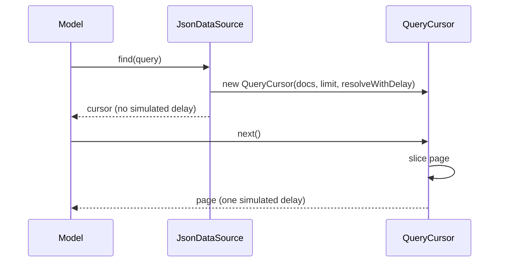
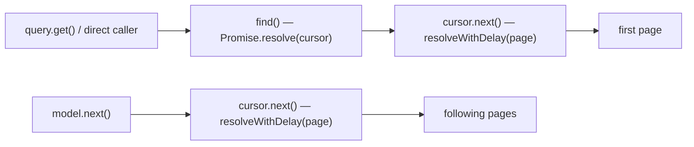

# Design — Single-delay cursor reads (gh-issue-17)

## Problem recap

In 2.0.0 `JsonDataSource.find()` resolves the `QueryCursor` through
`resolveWithDelay`, and `QueryCursor.next()` resolves every page through
`resolveWithDelay` again. `Model.query()` awaits `find()` and then calls
`cursor.next()`, so one `query.get()` pays **two** simulated delays (≈200 ms
with `simulateDelay(100)` instead of ≈100 ms in 1.61.1) and one extra
resolution stage. Consumers that both read a query and listen to it
(`onCollectionChange`) get re-ordered, which can flip last-writer-wins races.

## Decisions

### 1. Where the delay lives

| Option | Assessment |
| --- | --- |
| **A. `QueryCursor.next()` owns the delay; `find()` resolves the cursor undelayed** | One rule for every path: *every page read costs exactly one delay*. The cursor handle itself is pure local state (building it performs no I/O), so handing it over costs nothing — same as a real client assembling a query before fetching. First page (`query.get()`), later pages (`model.next()`), and direct `find()` callers all behave identically. |
| B. `find()` owns the delay, first `next()` is free, later `next()` delayed | Also one delay per read, but the rule is stateful (`next()` sometimes does not delay) and a caller that only builds a cursor still pays a delay for no I/O. |
| C. `Model.query()` special-cases the first read | Fixes only the model path; direct `find()` consumers keep the double delay. Rejected by the consistency requirement. |

**Chosen: A.** `find()` returns the cursor with `Promise.resolve` (no simulated
delay); the injected `QueryCursorResolver` keeps doing exactly one
`resolveWithDelay` per page.

### 2. Contract for every consumer path

- `query().get()` → `find()` (no delay) + first `next()` (one delay) = **1 delay**.
- `model.next()` → `cursor.next()` = **1 delay** per page.
- Direct `find()` → cursor arrives without consuming a delay; each
  `cursor.next()` = **1 delay**. Documented in the `DataSource.find` jsdoc.
- `onCollectionChange` interplay: a read started at *t* completes at *t + delay*
  (one timer), so a notification fired after one delay observes the read
  already resolved — restoring the 1.61.1 ordering.

### 3. Why not chase 1.61.1's microtask count

With no delay, 1.61.1 resolved `find()` docs in ~2 microtask ticks; the cursor
path takes ~5 (fetch cursor → `next()` promise → map to instances). That extra
cost is inherent to issue #15's contract (`find(): Promise<QueryCursor>` +
`next(): Promise<page>` = two promise stages); the only way to remove it would
be a synchronous `find()`, which breaks the `DataSource` interface implemented
by the sibling plugin repos (out of scope). The issue's own suggested fixes
have the same characteristic. What this fix restores is the *delayed* stage:
exactly one `simulateDelay` per read, matching 1.61.1's single delayed
resolution.

## Component interaction

## Proposed changes

- **`src/store/json-data-source.ts`**
  - `find()` builds the cursor and returns `Promise.resolve( cursor )` instead
    of `resolveWithDelay( cursor )`. Both branches (null query object and
    processed query) change; the synchronous `_simulateError.find` throw is kept.
  - `createCursor` still injects `resolveWithDelay`, so `next()` keeps one
    delay per page and every page promise still registers in `_pendingPromises`
    for `wait()`.
- **`src/store/data-source.ts`**
  - `find()` jsdoc documents the contract: the cursor is delivered as soon as
    it is built; the per-page async behaviour (one simulated delay per page in
    `JsonDataSource`) lives in `QueryCursor.next()`.
- **`src/store/model.ts`** — unchanged. The double delay was a data-source
  concern; `query()`/`next()` keep their two-stage cursor flow.

## Proposed tests

`src/store/model.spec.ts` — new block `Single-delay cursor reads [REQ-1..REQ-6]`
with one test per scenario of `specs/gh-issue-17/cursor-single-delay.feature`
(REQ-1, REQ-3 and REQ-5 fail on the unfixed code — the reproduction).

## Best practices used

- **Locality**: the delay rule lives in one place (`resolveWithDelay` injected
  into the cursor); `Model` stays ignorant of timing.
- **Deep seam**: only the data-source implementation changes; the
  `DataSource.find()` contract is documented once for all adapters.
- **Minimal diff**: no signature changes, so sibling plugin repos are not
  broken by this fix.

## Strengths

- One uniform rule ("a page read costs one delay") covers every consumer path.
- No interface change → no cross-repo breakage; only documentation follow-up.
- Interleaved per-query cursors (issue #15) untouched.

## Weaknesses

- `find()` no longer registers a pending promise, so `datasource.wait()`
  called synchronously right after `model.find().get()` sees an empty set
  (the first page promise registers one microtask later). Tests should await
  the read promise itself; `wait()` keeps its snapshot semantics.
- Microtask-tick parity with 1.61.1 is not achievable without a breaking
  synchronous `find()` (see decision 3).

## Audit note (code-auditor)

Audited against `cursor-single-delay.feature` and the modified sources
(`json-data-source.ts`, `data-source.ts`, `query-cursor.ts`), read from disk.

- **Overview**: the fix relocates the delay policy instead of adding logic:
  `find()` sheds `resolveWithDelay` and the already-injected
  `QueryCursorResolver` becomes the single owner of per-read async behaviour.
  The seam (`DataSource.find`) is real (two adapters), the interface grew only
  as documented invariants (no signature changes), and tests cross the public
  interface (`Query.get()`, `Model.next()`, `datasource.find()` +
  `cursor.next()`) without asserting private state.
- **Files**: `src/store/json-data-source.ts:82` (find),
  `src/store/data-source.ts:137` (find contract),
  `src/store/query-cursor.ts:36` (next contract), `src/store/model.ts`
  (untouched, verified).
- **Problem**: none blocking. Consistency of the new contract across the two
  documentation points (abstract `find` jsdoc and `QueryCursor.next` jsdoc) and
  the implementation comment was verified; the two `find()` branches mirror the
  pre-existing structure.
- **Solution**: no refactor applied. Less valuable improvements, not applied:
  - both `find()` branches could return from a single `Promise.resolve` call
    (cosmetic; would restructure pre-existing code for no behaviour gain).
  - `wait()` could loop until no pending promises remain so a synchronous
    `wait()` right after `query.get()` flushes chained page reads too; that is
    a public behaviour change outside this issue's scope (tests await the read
    promise instead).
  - the abstract `find` jsdoc names `JsonDataSource` concretely; acceptable as
    adapter guidance, slightly leaky for the abstract base.
- **Recommendation strength**: **Worth exploring** (only the `wait()` loop);
  nothing rises to **Strong**.

Re-verified after audit: full suite green.

## Master CI failure after #22 (run 37515782440)

### Root cause

`src/store/model.spec.ts` → `[REQ-5]` failed on the first master run
containing #22 together with #18/#21 ("emit initial collection snapshot on
subscribe"). It is a **test/spec interaction defect, not an ordering
regression**: the single-delay guarantee itself holds.

- #18/#21 made `JsonDataSource.onCollectionChange` deliver the current
  matching snapshot **synchronously at subscribe time**
  (`specs/gh-issue-18/collection-initial-snapshot.feature` [REQ-1]).
- The [REQ-5] test subscribes *before* starting the read, so the listener
  fires once at subscribe (`readResolved === false` → `read-after-change`)
  and again on the save at 150 ms (`readResolved === true` →
  `read-before-change`). Actual observations:
  `['read-after-change', 'read-before-change']` vs expected
  `['read-before-change']` — deterministic, reproduced locally on every run.
- The second (save-triggered) observation proves the guarantee under test:
  the read (~100 ms) resolved before the change notification (150 ms).

Why it only surfaced on master:

- PR #22's branch was cut from master @ 2.0.0 (`5af1a33`) — it does **not**
  contain #18/#21 (`3298cae`) or #20 (`177e938`), verified with
  `git merge-base --is-ancestor`. Running `[REQ-5]` on `7f0fe88` (PR #22
  head) passes: 1 passed / 78 skipped.
- `.github/workflows/release.yml` only triggers on `push` to `master`, so
  PR branches never run CI. The incompatible combination first existed on
  master after the squash merge.

### Fix

1. **Spec** — [REQ-5] scenario states the exact conditions: the listener is
   installed first (subscribe-time delivery precedes the read, issue #18),
   and the `Then` refers to the *save notification* only.
2. **Test** — the listener callback records observations only after
   subscription returns (the subscribe-time delivery is synchronous), and
   asserts the subscribe-time delivery happened. The assertion
   `toEqual([ 'read-before-change' ])` keeps its full strength: if the read
   had not resolved before the save, the recorded observation would be
   `read-after-change` and the test would fail.
3. **CI** — run the workflow on `pull_request` too, gating
   `semantic-release` to `push` on `master`, so this class of
   branch-interaction break is caught before merge (root of the escape:
   no PR CI at all).

No production code changes: both #17 and #18 contracts are correct as
specified; only the test expectation was wrong.

## Audit note (code-auditor — master CI failure fix)

Audited against `cursor-single-delay.feature` and the modified non-test
sources (`.github/workflows/release.yml`) read from disk; production code
(`src/**/*.ts` non-spec) is untouched by this fix.

- **Overview**: the fix relocates no behaviour — it aligns the [REQ-5] test
  with the already-specified subscribe contract of issue #18 (initial
  snapshot delivered synchronously on subscribe) and closes the CI escape
  (workflow never ran on pull requests).
- **Files**: `src/store/model.spec.ts` [REQ-5], `specs/gh-issue-17/
  cursor-single-delay.feature` [REQ-5], `.github/workflows/release.yml`.
- **Problem**: none blocking. The `if:` guard on `semantic-release`
  (`event_name == 'push' && ref == 'refs/heads/master'`) is doubly safe:
  `pull_request` runs also have `refs/pull/N/merge` as ref.
- **Less valuable improvements, not applied**:
  - split `release` into a separate job after `build` so PR-triggered runs
    never hold a write-capable token (**Worth exploring**, needs workflow
    restructure and secret-handling review).
  - add a `concurrency` group to cancel superseded PR runs (**Speculative**).
  - the subscribe-gate pattern in the test (`subscribing` flag) could be a
    helper if more specs need it; used once, not worth extracting
    (**Speculative**).
- **Recommendation strength**: nothing rises to **Strong**; no refactor
  applied.

Re-verified after audit: full suite green (297/297, three runs).
