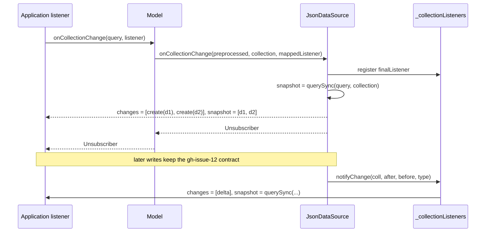
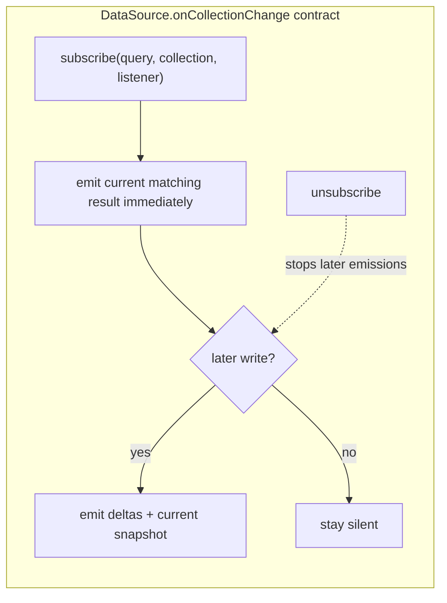

# Design — Emit the current collection snapshot when subscribing (gh-issue-18)

## Problem recap

`onCollectionChange` is inconsistent across data sources:

- Firestore's `onSnapshot` always fires an initial snapshot (all current docs reported
  as `added`), so `FirebaseDatasource` listeners receive the current result on subscribe.
- [`JsonDataSource.onCollectionChange`](file://src/store/json-data-source.ts:166) only
  indexes the listener; the listener is called later by `notifyChange`. Subscribing
  alone yields nothing until the next write.

A live view therefore needs a read plus a subscription on JSON, with the usual
read/subscribe race, while the same code works with a single subscription on Firebase.

## Strategy

Three decisions had to be made.

### 1. Payload shape of the initial emission

| Option | Assessment |
| --- | --- |
| One callback per current document | N callbacks per subscribe; consumers must still detect the end of the initial batch; diverges from Firestore's single `docChanges()` batch. |
| One callback with every current document as an `update` change | A consumer cannot distinguish the initial result from a later change of the same documents. |
| **One callback with every current document as a `create` change** | Matches Firestore: one snapshot event, every doc is "added" from the listener's point of view. Reuses the existing `create` type, so consumers branch on `type` uniformly. |

**Chosen: one callback.** `changes` holds one `{ before: undefined, after: doc,
type: 'create', params: {} }` entry per currently matching document, ordered like
the query result. The optional second argument — the mechanism introduced by
[gh-issue-12](specs/gh-issue-12/collection-removal-semantics-design.md) — carries
the full current matching result. This keeps the payload shape identical to the
existing change notifications (a firehose of deltas plus the up-to-date snapshot);
only the timing and the `create` typing are new.

### 2. Emission timing and the empty result

| Option | Assessment |
| --- | --- |
| Emit before registering the listener | A listener that is not yet registered cannot miss a write (single-threaded JS), but a write performed *inside* the listener would not be seen; and a throwing listener leaves nothing to clean up. |
| **Register, then emit synchronously** | Matches Firestore (register first, first event immediately after): a write performed by the listener is delivered as a subsequent event. Safe from missed writes because `JsonDataSource` is synchronous. |
| Emit asynchronously (microtask) | Adds scheduling to the mock source for no benefit; "immediately" is allowed but synchronous is simpler to test and to consume. |

Firestore also fires when the query matches nothing (empty snapshot). The same is
adopted here: subscribing always produces exactly one initial callback, even with
`changes = []` and `snapshot = []`. A consumer that replaces its list with the
snapshot therefore starts empty instead of "loading forever".

The abstract contract in [`DataSource.onCollectionChange`](file://src/store/data-source.ts:189)
is worded as *immediately on subscribe*: synchronous for in-memory sources,
scheduled-but-untriggered for remote ones. `JsonDataSource` is synchronous.

### 3. How to pin the contract for every data source

| Option | Assessment |
| --- | --- |
| Only test `JsonDataSource` | Does not help plugin authors; a divergent implementation goes unnoticed. |
| **A data-source-agnostic conformance suite parameterized by a factory** | The suite only uses the `DataSource` interface (`save`, `delete`, `onCollectionChange`, `DataSource` itself), so any implementation can run it. Running it against `JsonDataSource` in this repo pins the reference behavior; `entropic-bond-firebase` can run the same suite in the cross-repo follow-up. |
| Ship the suite as a public export | Pulls vitest globals into the built library; unnecessary for the core fix. |

**Chosen: an in-repo conformance suite.** [`src/store/data-source-contract.spec.ts`](file://src/store/data-source-contract.spec.ts)
exports `runDataSourceConformanceTests( name, createDataSource )` and runs it for
`JsonDataSource`. The remaining `[REQ-1..8]` behaviors get a `JsonDataSource`
specific spec because they assert synchronous timing and payload details.

## Component interaction

## Proposed changes

- **`src/store/data-source.ts`**
  - Document the subscribe contract on `CollectionChangeListener` and on the
    abstract `onCollectionChange`: one initial callback with the current matching
    result (each document typed `create`), then one callback per later change
    with the up-to-date snapshot.

- **`src/store/json-data-source.ts`**
  - After registering `finalListener`, build the initial `create` changes from
    `querySync( query, collectionName )` and invoke the listener once with
    `( changes, snapshot )`. Unsubscription behavior is unchanged.

- **`src/store/model.ts`**
  - No code change: `Model.onCollectionChange` already maps both `changes` and
    `snapshot` to `Persistent` instances, so the initial emission is delivered as
    instances. Covered by new tests.

- **`src/store/collection-initial-snapshot.spec.ts`** (new)
  - One test per `[REQ-1..8]`: synchronous initial emission, `create` payload,
    snapshot contents, empty result, query sort/limit, no replay on later writes,
    unsubscribe, model-level instances.

- **`src/store/data-source-contract.spec.ts`** (new)
  - `runDataSourceConformanceTests` + a run for `JsonDataSource` (`[REQ-9]`).

- **Existing specs — deliberate updates**
  - [`src/store/json-data-source.spec.ts`](file://src/store/json-data-source.spec.ts:128):
    collection-listener tests now observe the initial emission; assert the initial
    call explicitly and clear the mock before asserting deltas.
  - [`src/store/collection-change-removal.spec.ts`](file://src/store/collection-change-removal.spec.ts:30):
    clear the listener after subscribing so the gh-issue-12 assertions stay about
    the change under test, with a comment pointing at #18.
  - [`src/store/model.spec.ts`](file://src/store/model.spec.ts:726): clear the
    `collectionListener` mock after subscribing (the initial emission now happens
    in `beforeEach`), and after the local array-contains subscriptions.

## Best practices used

- **Liskov / Open–Closed**: the contract is documented on the `DataSource` seam;
  the only behavioral change is an additive initial callback, no signature change.
- **DRY**: the initial payload is built from the same `querySync` used by deltas.
- **Testability**: the contract is pinned once, implementation-agnostically, and
  the reference source pins the synchronous details.
- **Explicit updates**: every existing spec that observed "first call = first
  delta" now says what it ignores and why.

## Audit

Independent review of the feature file and the modified source
(`data-source.ts`, `json-data-source.ts`, tests excluded). The contract is stated
once at the `DataSource` seam and enforced by the conformance suite; the initial
payload reuses `querySync`, so no parallel query path was introduced. No **Strong**
recommendations; no code changes applied.

- **Worth exploring** — `DocumentChange` literals are now built in three places in
  `json-data-source.ts` (`notifyChange`, the filtered `finalListener` and the initial
  emission). A private builder could centralize the shape. Not applied: the three
  shapes differ (`collectionPath` only in `notifyChange`, `before` optional, `params`
  sourced) and the literals stay readable.
- **Worth exploring** — a listener that throws during the synchronous initial
  emission leaves the listener registered and the caller gets no unsubscriber.
  This matches `notifyChange` (which also does not guard listener errors) and
  Firestore, so it is deliberately out of scope.
- **Speculative** — the conformance suite is an exported function in a `*.spec.ts`.
  If the cross-repo follow-up wants to import it directly, it would need a shipped,
  vitest-globals-free export; the suite is currently copyable as-is.

## Weaknesses

- Existing consumers get an extra callback on subscribe. This is the intended
  breaking behavioral change, but any code that treats the first callback as a
  delta must be updated.
- The initial emission is synchronous for `JsonDataSource` but Firestore's first
  event is asynchronous; consumer code must still not assume synchronous delivery
  when targeting both sources.
- `DocumentChange.collectionPath` is absent from collection changes in
  `JsonDataSource` (pre-existing delta behavior); the initial emission matches that
  shape rather than fixing it.

## Tasks

1. Write the failing `[REQ-1..8]` tests in `src/store/collection-initial-snapshot.spec.ts`.
2. Write `src/store/data-source-contract.spec.ts` (`[REQ-9]`) and watch it fail.
3. Document the contract on `CollectionChangeListener` / `DataSource.onCollectionChange`.
4. Emit the initial snapshot in `JsonDataSource.onCollectionChange`.
5. Update the existing collection-listener specs deliberately.
6. Run `npm test`, refactor, then `npm run build`.
