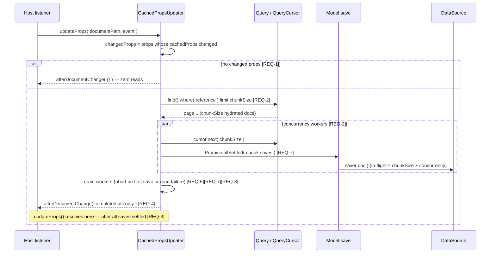
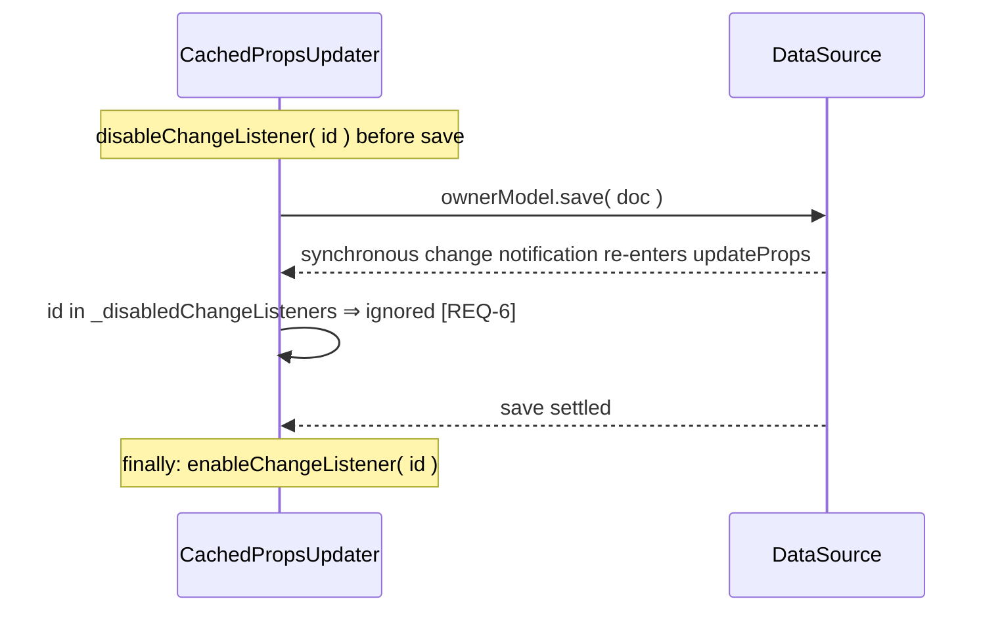
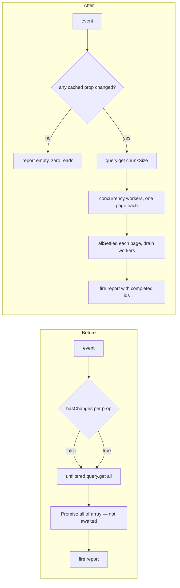

# Cached props fan-out resource safety — design (issue #19)

## Abstract

`CachedPropsUpdater.onDocumentChange()` is restructured so the fan-out owns its
resource usage:

- **Early-out**: the event is checked against every watched `prop.cachedProps`
  *before* any query is built. No changed cached prop ⇒ no owner-collection read
  (the redundant per-document re-check disappears).
- **Chunked worker pool**: each owner-collection query runs with `limit(chunkSize)`
  and is consumed through its `QueryCursor` by a pool of `concurrency` workers.
  Each worker fully settles one chunk before pulling the next, so in-flight saves
  are bounded by `chunkSize × concurrency` (defaults 25 × 4 = 100).
- **Real awaiting**: the broken `Promise.all([ result.map(...) ])` nesting is gone.
  `updateProps()` resolves only after every save settles. On failure no new page is
  pulled; the failing page's saves are drained with a per-page `Promise.allSettled`,
  the workers are drained with an outer `Promise.allSettled`, then the first error
  propagates — no unhandled rejections, and a page-read failure aborts the other
  workers too.
- **Reporting**: `afterDocumentChange` fires after all saves completed and reports
  only ids whose save resolved.
- **Re-entrancy guard**: document ids written by the fan-out stay disabled only
  while their save is in flight and are re-enabled in a `finally` (previously a
  rejected save left the id disabled forever).

## Seams and data flow

Guard flow (in-process):

## Configuration

`CachedPropsUpdaterConfig` gains two numeric options (constructor-only, consistent
with the existing config shape):

| Option | Default | Meaning |
| --- | --- | --- |
| `chunkSize` | 25 | page size of the owner query; docs hydrated per chunk; saves dispatched per chunk |
| `concurrency` | 4 | number of chunks processed in parallel; in-flight saves ≤ `chunkSize × concurrency` |

Both are sanitized with `Math.max( 1, Math.floor( value ) )` so a `0`/negative
value cannot disable the pool or produce an unbounded `get()`. A limit set by
`beforeQueryOwnerCollection` is preserved as a *total cap* on processed owners.

## Plan

1. Feature file: `specs/gh-issue-19/cached-props-fanout.feature` ([REQ-1..8]).
2. Tests (TDD, red first) appended to `src/store/cached-props-updater.spec.ts`
   in a new describe block named after the feature.
3. Rewrite `onDocumentChange` in `src/store/cached-props-updater.ts`:
   event-level `changedProps` filter → sequential prop/collection loop →
   chunked worker pool → awaited, drain-on-failure completion → report.
4. Fix guard lifecycle with `try/finally`.
5. Full suite green, then audit.

Follow-up (audit changes requested, PR #24): per-page `Promise.allSettled` so the
failing page's saves are drained before rejecting (`[REQ-7]`), abort on a page-read
failure (`[REQ-8]`), and a `@throws` contract on `updateProps`.

## Changes

- `src/store/cached-props-updater.ts` — restructured `onDocumentChange`, new
  `hasCachedPropsChanges()`, `fanOutToCollection()`, `takePage()`,
  `updateOwnerDocument()` private helpers; `chunkSize`/`concurrency` config;
  per-page `Promise.allSettled` drain and read-failure abort.
- `src/store/cached-props-updater.spec.ts` — new describe block, [REQ-1..8] plus
  supplementary cap/sanitization/page-fetch tests.
- `specs/gh-issue-19/cached-props-fanout.feature` — requirements.
- No public API break: `updateProps()`, callbacks and `UpdatedResults` keep
  their shape; `totalDocumentsToUpdate` is now computed at completion instead
  of before processing (same value on success).

## Decisions

- **Sequential props and matching collections.** The worker pool bounds saves
  *within* one collection query; serialising the outer loops keeps the global
  bound at `chunkSize × concurrency` regardless of how many props/collections a
  class watches. Props per collection are few, so latency is unaffected.
- **Worker pool over pages instead of one flat `Promise.all`.** Pages are pulled
  through the existing `QueryCursor` (position advances synchronously, so
  concurrent `next()` calls are safe); memory holds at most
  `concurrency × chunkSize` hydrated documents.
- **Per-page `Promise.allSettled` drain, outer worker drain.** `updateProps()` never
  resolves early and never rejects while work is still in flight: a failing save is
  detected after every save of its page settled (`[REQ-7]`), no new page is pulled,
  the workers settle, then the first error is rethrown — every rejection is handled.
- **Read failures abort the fan-out too.** `takePage()` is guarded so a cursor read
  rejection sets `aborted` before rethrowing, stopping the other workers from pulling
  more pages (`[REQ-8]`).
- **Re-entrancy (issue defect 4).** What this package can do:
  1. in-process guard, now `finally`-safe and meaningful because saves are
     actually awaited (`[REQ-6]`);
  2. the `[REQ-1]` early-out means a re-entrant *owner* event — which changes
     only the cached reference field — performs **zero reads and zero writes**
     even on a fresh instance. This is what neutralises the incident's
     cross-invocation fan-out loops in practice.
  **Remaining deployment-level limitation:** there is no shared/persistent channel
  inside this package to deduplicate events across processes. A re-entrant event
  that changes a genuine cached prop of a *watched* collection (only possible
  through circular cached-prop setups or host `beforeUpdateDocument` mutations
  that touch a watched field) would still fan out on a fresh instance. Hosts that
  need hard cross-invocation dedup must filter events in their own transport
  (e.g. tag function writes), which is out of scope for this repo.

## Strengths / weaknesses

- Strengths: bounded memory (page-sized hydration), bounded writes
  (`chunkSize × concurrency`), error propagation, zero-read hot path for
  unrelated writes, no public API break.
- Weaknesses: `documentsToUpdate` ids are still accumulated for the whole run
  (strings only — cheap, but O(N) memory); cross-process re-entrancy relies on
  the early-out rather than shared dedup state (documented above).

## Audit

Independent audit of the implemented source (`src/store/cached-props-updater.ts`) against
`specs/gh-issue-19/cached-props-fanout.feature`. Reviewed without relying on this document's
rationale.

### Overview

The external interface is unchanged and stays small: `updateProps()`, the callback setters and
`collectionsToWatch`. All new behaviour (event-level change detection, paging, the bounded worker
pool, failure draining, guard lifecycle) lives behind private methods, so callers and tests
continue to cross the same seam. `fanOutToCollection` is the deep unit: it hides the whole
resource strategy behind one call. The deletion test passes — removing it would push paging,
concurrency and error draining into every `updateProps` caller.

### Files

- `src/store/cached-props-updater.ts` — deep module, only file of the implementation.
- No other module needed adaptation: the fan-out uses the existing `Model`/`Query`/`QueryCursor`
  seam and the existing `DataSource` interface.

### Problem → Solution

| Prior friction | Now |
| --- | --- |
| Resource policy interleaved with the fan-out loop | Policy local to `fanOutToCollection` (`takePage`, `worker`, `updateOwnerDocument`) |
| Query executed before deciding there was work | `changedProps` filter first; no work ⇒ no query |
| `Promise.all([ a.map(…) ])` silently non-awaiting | Per-page `Promise.allSettled` drain, worker drain and rethrow of the first failure |
| Guard left permanently disabled after a rejected save | `try/finally` re-enables the id |

### Benefits

- **Locality**: all bounds (chunk size, concurrency, cap, failure drain) change in one place.
- **Leverage**: `updateProps` now guarantees completion-on-resolve and rejection-on-failure for
  every host, without new methods.
- **Testability**: the seam is still `updateProps`; tests observe the data source and callbacks.

### Before / after

### Findings

- **`_disabledChangeListeners` is keyed by document id across collections** — a doc id shared by
  two collections in one run can suppress the other's event. Pre-existing; kept as is to avoid
  changing the guard's contract in this fix. **Worth exploring.**
- **`documentsToUpdate` keeps every matched id for the whole run** — required by the existing
  `UpdatedResults` shape; strings only, so bounded but O(N). **Worth exploring** (would need a
  streaming/interface change).
- **`searchableArray` with `index === -1` writes `array[-1]`** — pre-existing, out of scope.
  **Speculative.**
- **Consumers must handle the now-propagating rejection** — hosts that fire-and-forget
  `updateProps()` (as the bundled sample does) will surface a save failure as an unhandled
  rejection. This is the acceptance criterion, not a defect; flagged for hosts.
- Internal closure state (`firstPageTaken`, `taken`, `hasMore`) is subtle but small and
  synchronously reserved; an explicit `PageStream` helper would make the invariant louder.
  **Worth exploring.**
- The supplementary page test spies `QueryCursor.prototype.next`, an internal seam of a sibling
  module; acceptable for a resource-bound supplementary assertion, not for a `[REQ-n]` test.
  **Speculative.**

No **Strong** recommendation remains; no further refactor was applied after the audit.

### Follow-up — independent audit of PR #24 (`eb-24-code-audit`)

An independent audit returned **CHANGES REQUESTED** with two failure-path gaps, approved for
fixing:

- **F1 (medium, `[REQ-7]`).** The per-page `Promise.all` short-circuited on the first rejected
  save, so `updateProps()` rejected while the failing page's siblings were still in flight.
  Fixed: the page now settles through `Promise.allSettled`, then `aborted = true` and the first
  rejection reason is thrown — the page is fully drained before the promise rejects.
- **F2 (low, `[REQ-8]`).** A `takePage()` cursor-read failure did not set `aborted`, so other
  workers kept pulling every remaining page. Fixed: `await takePage()` is guarded by
  `try/catch`, sets `aborted = true` and rethrows.
- **F4.** `updateProps` now carries a `@throws` JSDoc contract for save, read and callback
  failures. (The `BREAKING CHANGE:` footer suggestion was not applied — the contract change is
  documented, and this is a patch release decision owned by the maintainer.)
- **F5.** Added the red tests for F1 (`[REQ-7]`, `settled === chunkSize` at rejection and no
  further page pulled) and F2 (`[REQ-8]`, no page read after the failure), plus supplementary
  tests for the `beforeQueryOwnerCollection` total cap and for `chunkSize`/`concurrency`
  sanitization. Both `[REQ-7]`/`[REQ-8]` tests were verified red on the pre-fix implementation
  (`settled = 1`; `nextCalls = 10`).
- **F3** (refcounted/keyed guard), the `PageStream` extract, and the `wait()`/sample wording
  notes were not applied — out of the approved item list.

Re-verified after the follow-up: `src/store/cached-props-updater.spec.ts` 19/19 green, full suite
and build green.

